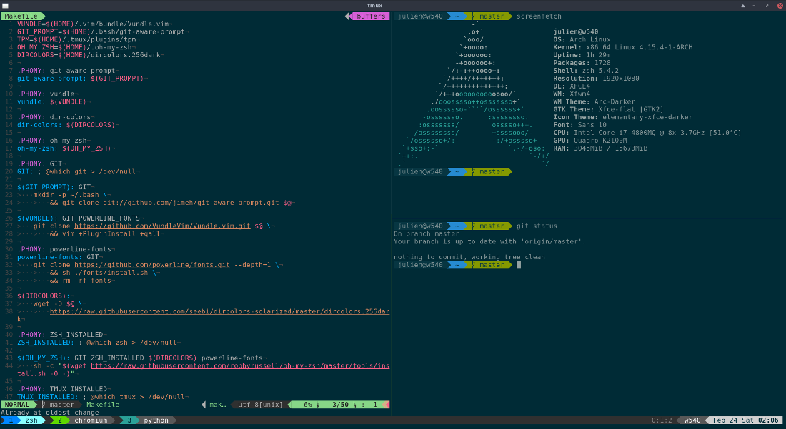

# Groovytron dotfiles

This is a quick backup of my dotfiles to make tool configuration easier in case
of system issue. The `M̀akefile` might not work correctly but at least it gives
you an idea of how to install the tools you want.

I use the below tools.

## Shells

- [`bash`](https://www.gnu.org/software/bash/) (because it's simple and quite
  easy to tweak). Check the `.bashrc` and `.bash_profile` files for settings details.
- [`oh-my-zsh`](https://github.com/robbyrussell/oh-my-zsh)
  (when I want a fancy shell). Check the `.zshrc` file for settings details.
- [`tmux`](https://github.com/tmux/tmux/wiki) as a terminal multiplexer with
  both of the above shells. Check the `.tmux.conf` file for settings details.
  - [`tpm`](https://github.com/tmux-plugins/tpm) which stands for Tmux Plugin Manager.
- Shells themes can be found in the `.Xresources.basic` file which contains
  a simple theme that I did by myself.
  The `.Xresources.solarized` file contains a
  [solarized color theme](http://ethanschoonover.com/solarized).
  To use one of these themes, just copy the one you want into
  your home directory and rename it into
  `.Xresources`. Do not forget to reboot or launch `xrdb ~/.Xresources`
  to apply the theme in the next terminals you will open.

If you are interested in how X clients configuration works.
Have a look [here](https://wiki.archlinux.org/index.php/x_resources).

## Editors

- [`vim`](http://www.vim.org/) with some plugins (check the `.vimrc`)

## Miscellaneous

- I use the [patched fonts for Powerline](https://github.com/powerline/fonts)
  to get all the characters displayed nicely in the shells.
  The following plugins are used for vim and tmux to get powerline everywhere:
  - vim: [`vim-airline`](https://github.com/vim-airline/vim-airline)
  - tmux: [`tmux-powerline-theme`](https://github.com/jooize/tmux-powerline-theme)

## Result

Here is how it looks with zsh, tmux and vim configured:

